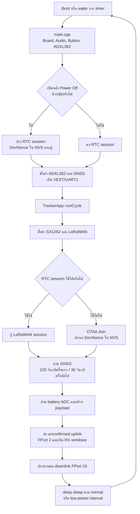
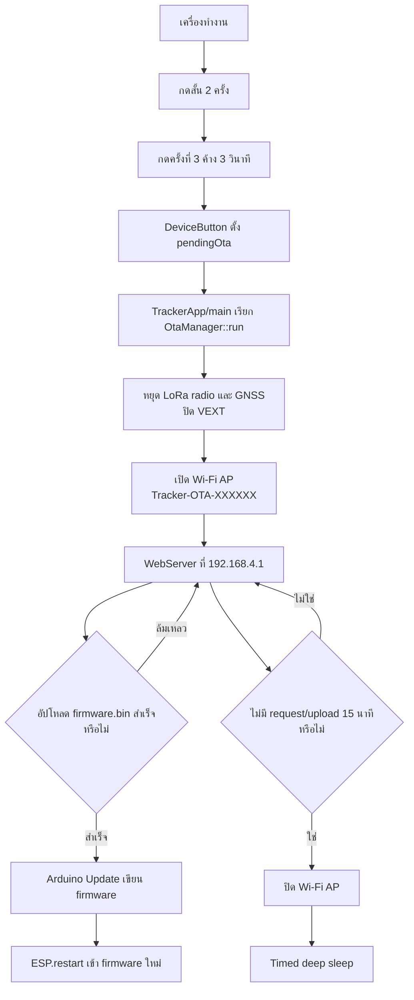
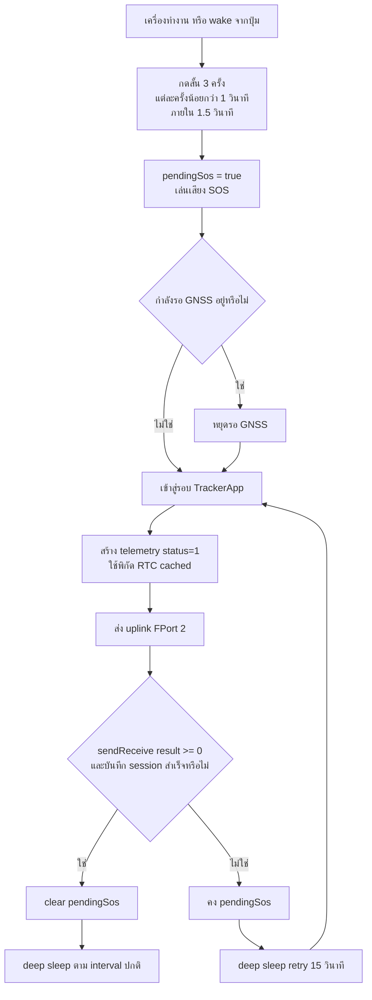
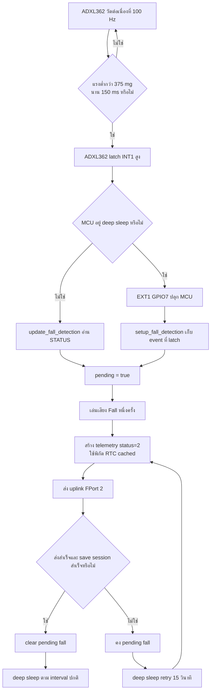

# คู่มือผู้ใช้และผู้พัฒนา Firmware Tracker

เอกสารนี้จัดทำจากการอ่านโค้ดใน `src/`, `include/` และค่าการ build ใน
`platformio.ini` โดยตรง ไม่อ้างพฤติกรรมจากเอกสาร Markdown เดิม Firmware
ปัจจุบันที่ระบุใน `include/firmware_version.h` คือ **v1.2**

> ห้ามเผยแพร่ไฟล์ `include/lorawan_credentials.h` หรือค่า JoinEUI, DevEUI และ
> AppKey เพราะเป็นข้อมูลสำหรับเข้าระบบ LoRaWAN

## 1. Source code

### ภาพรวมการทำงาน

เมื่อบอร์ดตื่นจากการเปิดเครื่อง, timer, ปุ่ม หรือ ADXL362 firmware จะทำงานเป็น
หนึ่งรอบดังนี้

```text
ตื่นจาก deep sleep / เปิดเครื่อง
  → ตรวจปุ่มและเหตุการณ์ล้ม
  → เปิด GNSS และรอพิกัดตามเวลาที่กำหนด (production)
  → กู้ LoRaWAN session จาก RTC หรือทำ OTAA Join
  → สร้าง payload แล้วส่ง uplink FPort 2
  → รับ downlink ใน Class-A receive windows
  → ปิด GNSS / radio และเข้า deep sleep
```

ใน Debug mode จะข้าม GNSS และสร้างพิกัดเดินจำลองแทน แต่ยังใช้ LoRaWAN,
ปุ่ม, ADXL362 และ deep sleep จริง

### Flowchart: การทำงานปกติ



### Flowchart: OTA ผ่าน Wi-Fi



### Flowchart: SOS



### Flowchart: Fall detection



หมายเหตุ: `sendReceive=0` หลัง uplink ไม่ได้หมายถึง gateway รับข้อมูลแล้ว
แต่หมายถึงไม่มี downlink ใน receive window ของ Class A

### โครงสร้างโฟลเดอร์

| ตำแหน่ง | หน้าที่ |
| --- | --- |
| `src/main.cpp` | จุดเริ่มต้น ตั้งค่า Serial, Debug และเริ่มอุปกรณ์แต่ละส่วน |
| `src/tracker_app.cpp` | ควบคุมหนึ่งรอบของ tracker: อ่านข้อมูล, ส่ง LoRaWAN, จัดการเหตุการณ์, เลือกเวลานอน |
| `src/lora_wan.cpp` | ตั้งค่า SX1262/AS923, OTAA Join, ส่ง uplink และรับ downlink |
| `src/lorawan_storage.cpp` | เก็บ session/frame counter ใน RTC และเก็บ DevNonce อย่างปลอดภัยใน NVS |
| `src/telemetry.cpp` | อ่าน/เข้ารหัส latitude, longitude, status, version และแบตเตอรี่เป็น payload 15 bytes |
| `src/gnss.cpp` | สั่ง VEXT, UART1 และอ่าน NMEA จาก L76L |
| `src/fall_detection.cpp` | ตั้งค่า ADXL362, ตรวจ free-fall และเตรียม interrupt ปลุกจาก deep sleep |
| `src/device_button.cpp` | debounce ปุ่ม, SOS, เปิด/ปิดเครื่อง และเข้า OTA mode |
| `src/deep_sleep.cpp` | ตั้ง timer/button/fall wake source และเข้าสู่ deep sleep |
| `src/power_mode.cpp` | รับ downlink FPort 10 เพื่อเปิด/ปิด Low Power Mode |
| `src/battery.cpp` | อ่าน ADC GPIO2 และคำนวณแรงดัน/เปอร์เซ็นต์แบตเตอรี่ |
| `src/audio_feedback.cpp` | จังหวะเสียง buzzer ของสถานะต่าง ๆ |
| `src/ota_manager.cpp` | สร้าง Wi-Fi AP และเว็บอัปโหลด firmware ภายในเครื่อง |
| `src/board_pins.cpp` | ควบคุม VEXT, LED, buzzer, vibration และสถานะขาก่อนนอน |
| `src/debug_mode.cpp` | สร้างเส้นทางเดินจำลองและ log สำหรับ Debug mode |
| `include/` | header, pin map, ค่าคอนฟิก และตัวอย่าง credential |
| `test/` | host-side regression tests สำหรับ session, payload, ปุ่ม, fall และ power mode |

### ไฟล์คอนฟิกที่ปรับบ่อย

| ไฟล์ | ค่าที่เกี่ยวข้อง | คำอธิบาย |
| --- | --- | --- |
| `src/main.cpp` | `LORA_DEBUG` | `true` = เดินจำลองและส่งตาม Debug interval; `false` = ใช้ GNSS จริง |
| `src/main.cpp` | `LORA_DEBUG_INTERVAL_MS` | รอบ deep sleep ใน Debug mode; ค่าเริ่มต้น 15,000 ms |
| `include/app_config.h` | `reportIntervalMs` | รอบรายงานปกติ; โค้ดปัจจุบัน 1 นาที |
| `include/app_config.h` | `lowPowerIntervalMs` | รอบรายงาน Low Power; โค้ดปัจจุบัน 15 นาที |
| `include/app_config.h` | `firstGpsTimeoutMs` / `gpsTimeoutMs` | เวลารอ GNSS ครั้งแรก 120 วินาที / ครั้งถัดไป 30 วินาที |
| `include/app_config.h` | `uplinkPort` / `uplinkDataRate` | FPort 2 และ DR3 (AS923 SF9/BW125) |
| `include/firmware_version.h` | `major`, `minor` | หมายเลข firmware ใน payload; ปัจจุบัน 1.2 |
| `include/board_pins.h` | GPIO ทั้งหมด | แก้เมื่อเปลี่ยน hardware เท่านั้น |

### ขาสำคัญของบอร์ด

| อุปกรณ์ | ขา ESP32-S3 | หมายเหตุ |
| --- | --- | --- |
| GNSS TX → ESP RX | GPIO41 | UART1, 9600 baud |
| GNSS VCC / VEXT | GPIO36 | active-low: LOW = เปิด, HIGH = ปิด |
| ADXL362 CS/MISO/MOSI/SCK | 33 / 34 / 35 / 37 | SPI ของ accelerometer |
| ADXL362 INT1 | GPIO7 | interrupt ปลุกจาก deep sleep |
| S2 / BOOT | GPIO0 | active-low; เป็นปุ่มผู้ใช้และขา bootloader |
| Buzzer | GPIO4 | เสียงแจ้งสถานะ |
| Vibration | GPIO5 | สงวนไว้; firmware ปัจจุบันยังไม่ใช้ |
| LED2 / CPU_LED | GPIO40 | ติดเมื่อ MCU ทำงาน; ดับก่อนนอน |
| Battery ADC | GPIO2 | divider 750 kΩ / 360 kΩ |
| LoRa SX1262 | 8–14 | bus ภายในโมดูล; ไม่ควรเปลี่ยนโดยไม่มี hardware ใหม่ |

### LoRaWAN และข้อมูลที่ส่ง

- ใช้ **OTAA**, Region **AS923**, Class A และ uplink แบบ unconfirmed
- ส่งที่ FPort `2` ขนาด 15 bytes
- `status`: `0` = ปกติ, `1` = SOS, `2` = ตรวจพบ free-fall/suspected fall
- payload มีพิกัด, flags, firmware version, แรงดันแบตเตอรี่ และเปอร์เซ็นต์แบตเตอรี่
- byte layout ถูกสร้างใน `src/telemetry.cpp`: status, latitude, longitude,
  flags, firmware version, battery mV และ battery percent ตามลำดับ

Session ปกติอยู่ใน RTC memory จึงตื่นจาก timer/fall/SOS แล้วส่งต่อได้โดยไม่ Join ใหม่
ทุกครั้ง เพื่อประหยัดแบตเตอรี่ แต่การ **ปิดด้วยปุ่มแล้วเปิดด้วยปุ่ม** จะล้างเฉพาะ
RTC session และทำ OTAA Join ใหม่ ส่วน DevNonce ใน NVS จะไม่ถูกล้าง

### การใช้งานปุ่มและเสียง

| สถานะ | การกดปุ่ม S2 | ผลลัพธ์ |
| --- | --- | --- |
| เครื่องเปิด | กดสั้น 3 ครั้ง แต่ละครั้งน้อยกว่า 1 วินาที ภายใน 1.5 วินาที | ส่ง SOS (`status=1`) |
| เครื่องเปิด | กดค้างอย่างน้อย 3 วินาที | เลือกปิดเครื่อง; ปล่อยปุ่มแล้วจึง deep sleep |
| เครื่องเปิด | กดสั้น 2 ครั้ง แล้วกดครั้งที่ 3 ค้าง 3 วินาที | เข้า OTA mode ทันที |
| เครื่องปิด | กดค้าง 1–4 วินาที แล้วปล่อย | เปิดเครื่องและ OTAA Join ใหม่ |

เสียง buzzer จะแตกต่างกันสำหรับเปิด/ปิด, SOS, fall, กำลัง OTAA Join, Join สำเร็จ,
OTA mode และก่อน deep sleep

## 2. วิธีการโปรแกรมอุปกรณ์

### 2.1 เตรียมเครื่องมือ

1. ติดตั้ง [VS Code](https://code.visualstudio.com/) และส่วนขยาย PlatformIO IDE
2. เปิดโฟลเดอร์ project นี้ใน VS Code
3. ใช้ serial port ที่เชื่อมต่อกับ ESP32-S3 สำหรับ upload
4. ต่อเสาอากาศ LoRa ก่อนส่งสัญญาณทุกครั้ง

โปรเจกต์กำหนด environment ชื่อ `heltec_wifi_lora_32_V3` ใน `platformio.ini`
และใช้ Arduino framework โดย GPIO ที่ firmware ใช้กำหนดไว้ใน `include/board_pins.h`

### 2.2 ตั้งค่า LoRaWAN credential

คัดลอกไฟล์ตัวอย่างก่อน build ครั้งแรก:

```bash
cp include/lorawan_credentials.example.h include/lorawan_credentials.h
```

เปิด `include/lorawan_credentials.h` แล้วใส่ JoinEUI, DevEUI และ AppKey ที่
ระบบ LoRaWAN ออกให้ โค้ดเรียก `node.beginOTAA()` ด้วยค่าเหล่านี้โดยตรง
ห้ามนำ AppSKey ของ ABP มาใส่แทน AppKey

### 2.3 Build

ใน PlatformIO terminal ให้รัน:

```bash
pio run -e heltec_wifi_lora_32_V3
```

เมื่อ build สำเร็จ ไฟล์สำหรับ flash/OTA คือ:

```text
.pio/build/heltec_wifi_lora_32_V3/firmware.bin
```

### 2.4 Upload ผ่าน USB

ตรวจพอร์ตก่อน:

```bash
pio device list
```

แล้ว upload โดยแทนพอร์ตให้ถูกต้อง:

```bash
pio run -e heltec_wifi_lora_32_V3 -t upload --upload-port PORT
```

ตัวอย่าง `PORT`: `COM5` (Windows), `/dev/ttyACM0` (Linux),
`/dev/cu.usbmodemXXXX` (macOS)

หากอัปโหลดไม่สำเร็จ ให้ใช้วิธีเข้า download mode ของ ESP32-S3 ที่ตรงกับ
วงจร/adapter ที่ใช้อยู่ แล้วตรวจพอร์ตด้วย `pio device list` ก่อนสั่ง upload ใหม่
รายละเอียดการต่อสายไม่ได้อยู่ใน source code จึงไม่สรุปเป็นข้อเท็จจริงในคู่มือนี้

### 2.5 Update แบบ OTA ผ่าน Wi-Fi

1. ขณะเครื่องเปิด กด S2 สั้น 2 ครั้ง
2. กด S2 ครั้งที่ 3 ค้าง 3 วินาที; ไม่จำเป็นต้องปล่อย
3. ดู Serial Monitor จะพบชื่อ AP เช่น `Tracker-OTA-C13DE8`
4. เชื่อม Wi-Fi นั้น (เป็น open network)
5. เปิด `http://192.168.4.1`
6. เลือก `.pio/build/heltec_wifi_lora_32_V3/firmware.bin` แล้วกด Upload
7. รอข้อความสำเร็จ; บอร์ดจะ restart เข้า firmware ใหม่เอง

OTA จะปิด radio/GNSS ชั่วคราว และหมดเวลาเมื่อไม่มีการใช้งาน 15 นาที
ผู้ที่เชื่อม AP ได้สามารถ upload firmware ได้ ดังนั้นใช้งานในสถานที่ปลอดภัยเท่านั้น
ใช้แหล่งจ่ายไฟนิ่งระหว่าง OTA ห้ามตัดไฟระหว่าง upload

## 3. การ Debug

### 3.1 เปิด Debug mode

แก้ `src/main.cpp`:

```cpp
constexpr bool LORA_DEBUG = true;
constexpr uint32_t LORA_DEBUG_INTERVAL_MS = 15000;
```

build และ upload ใหม่ Debug mode จะ:

- deep sleep จริงทุกประมาณ 15 วินาที (เวลาบูตและ radio เพิ่มจากนั้น)
- สร้างพิกัดเดินจำลองแทน GNSS
- ใช้ LoRaWAN, ADXL362, ปุ่ม และเสียงจริง
- แสดง log เพิ่มเติม เช่น `[SIMULATED WALK]`, `[DEBUG]` และผล radio

หลังทดสอบต้องเปลี่ยน `LORA_DEBUG = false` แล้ว build/upload ใหม่เสมอ

### 3.2 เปิด Serial Monitor

```bash
pio device monitor --port PORT --baud 115200
```

ข้อความสำคัญที่ควรตรวจ:

| Log | ความหมาย / สิ่งที่ควรทำ |
| --- | --- |
| `[ADXL362] Ready` | sensor พร้อมใช้งาน |
| `[GPS] Fix acquired` | ได้พิกัด GNSS แล้ว |
| `[LoRa] OTAA Join successful` | Join สำเร็จ |
| `[LoRa] Session restored from RTC` | ตื่นจาก deep sleep และใช้ session เดิม |
| `[LoRa] TX ...` | firmware ส่ง packet ออกวิทยุแล้ว ไม่ใช่หลักฐานว่า gateway รับแล้ว |
| `sendReceive=0` | ส่ง uplink แล้วแต่ไม่มี downlink; ปกติสำหรับ unconfirmed uplink |
| `sendReceive=1/2` | ได้ downlink ใน receive window |
| `[SLEEP] Timer: ...` | กำลังเข้า deep sleep; เป็นพฤติกรรมปกติ |
| `[WAKE] Timer/Button/Fall sensor` | สาเหตุที่บอร์ดตื่น |
| `[BAT] ...` | แรงดันและเปอร์เซ็นต์แบตที่อ่านได้ |

### 3.3 ตรวจ LoRaWAN

โค้ดส่ง uplink แบบ unconfirmed (`sendReceive(..., false, ...)`) ดังนั้น
`[LoRa] TX ...` และ `sendReceive=0` ยืนยันเพียงว่า firmware จบการส่งโดยไม่มี
downlink ไม่ได้ยืนยันว่า network server ได้ข้อมูล

หาก Join ไม่สำเร็จ (`[LoRa] OTAA Join failed: -1116`) ให้ตรวจค่า credential,
การตั้งค่า network ให้ตรงกับ AS923/923.2 MHz และ coverage ของ gateway
ไม่ควรล้าง NVS เพื่อแก้โดยไม่มีการประสานกับ LoRaWAN server เพราะ DevNonce ต้องไม่ซ้ำ

### 3.4 Debug GNSS

สำหรับดู NMEA ดิบ ให้ตั้ง:

```cpp
constexpr bool GNSS_DEBUG = true;
```

หากเห็น NMEA แต่พิกัดยัง invalid ให้พาเสา/บอร์ดออกสู่ท้องฟ้าโล่งและรอ fix
ข้อความ `Valid NMEA received but no position fix` หมายถึง UART และ GNSS ทำงาน
แล้ว แต่ยังจับดาวเทียมไม่สำเร็จ ไม่ได้หมายถึง firmware ส่งพิกัดผิด

### 3.5 ทดสอบ fall detection อย่างปลอดภัย

- วาง/ปล่อยอุปกรณ์ลงบนวัสดุนุ่มหรือ padded fixture เท่านั้น
- ห้ามทดสอบโดยปล่อยอุปกรณ์ใส่คนหรือพื้นแข็ง
- ADXL362 จะมองหาแรงต่ำกว่า 375 mg ต่อเนื่อง 150 ms
- เหตุการณ์นี้เป็น **suspected fall/free-fall** ไม่ใช่ human-fall classifier แบบสมบูรณ์
- เมื่อ deep sleep, INT1 ของ ADXL362 สามารถปลุก MCU ได้ และ firmware จะส่ง `status=2`

### 3.6 Low Power Mode จาก downlink

ส่ง downlink FPort `10` จาก LoRaWAN network server:

| คำสั่ง | Base64 | ผล |
| --- | --- | --- |
| `01 00 0F` | `AQAP` | เปิด Low Power Mode; ใช้ `lowPowerIntervalMs` |
| `00 00 00` | `AAAA` | ปิด Low Power Mode; กลับไปใช้ `reportIntervalMs` |

Class A รับคำสั่งได้เฉพาะ receive window หลัง uplink เท่านั้น ดังนั้นการ queue
downlink สำเร็จไม่ได้หมายความว่าบอร์ดใช้คำสั่งแล้วทันที ตรวจ log `[APP] Low Power ...`
หรือ uplink ถัดไปประกอบ

## ไฟล์ต้นทางที่ใช้ตรวจสอบคู่มือนี้

- `src/main.cpp`, `src/tracker_app.cpp`: ลำดับการทำงานหลัก
- `src/lora_wan.cpp`, `src/lorawan_storage.cpp`: OTAA, session และ DevNonce
- `src/device_button.cpp`, `src/deep_sleep.cpp`: ปุ่มและ wake/sleep
- `src/gnss.cpp`, `src/fall_detection.cpp`, `src/battery.cpp`: sensor และ battery
- `src/telemetry.cpp`, `src/power_mode.cpp`, `src/ota_manager.cpp`: payload, downlink และ OTA
- `include/app_config.h`, `include/board_pins.h`, `include/firmware_version.h`, `platformio.ini`:
  ค่า configuration ที่ firmware ใช้งานจริง
